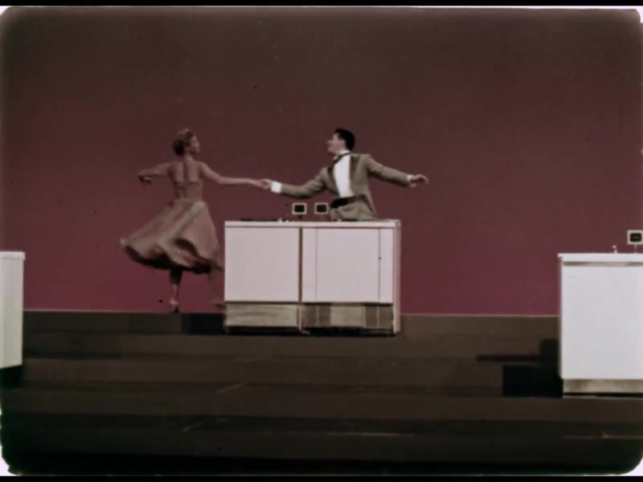

# Prelinger Decentralized Video Processing Pipeline
<p align="center">
    
  </p>

References:
* https://archive.org/details/prelinger
* https://bacalhau.org/

# Scale video resolution with ffmpeg

<p align="center">
    
  </p> 


```bash
# Local Docker test on Mac
export INPUTFILENAME=Fridgidaire_Final_001_4444HQ_800x600.mov
export OUTPUTFILENAME=Fridgidaire_Final_001_4444HQ_150x100.mov
docker run --rm -v $PWD/assets/videos:/inputs -v $PWD/assets/videos:/outputs\
    linuxserver/ffmpeg \
    -i /inputs/${INPUTFILENAME} -vf scale=150:100 \
    /outputs/${OUTPUTFILENAME}

# Bacalhau
# inputs folder IPFS CID for Fridgidaire_Final_001_4444HQ_800x600.mov: bafybeihjplsav7f4lr4evqry4vka6j7kghhmwi4jcnmqazuwpnyid72buy
# https://api.estuary.tech/gw/ipfs/bafybeihjplsav7f4lr4evqry4vka6j7kghhmwi4jcnmqazuwpnyid72buy
bacalhau docker run \
    -v bafybeihjplsav7f4lr4evqry4vka6j7kghhmwi4jcnmqazuwpnyid72buy:/inputs \
    --id-only\
    linuxserver/ffmpeg \
    -- ffmpeg -i /inputs/${INPUTFILENAME} -vf scale=150:100 \
    /outputs/${OUTPUTFILENAME}

```


# Export screenshot images (frames) with ffmpeg
```bash
# Local Test
export INPUTFILENAME=Fridgidaire_Final_001_4444HQ_800x600.mov
export OUTPUTFILESTRING=Frigidaire_%04d.jpg

ffmpeg -i assets/videos/${INPUTFILENAME} -r 0.05 assets/frames/${OUTPUTFILESTRING}

export INPUTFILENAME=Japanese1943.mp4
export OUTPUTFILESTRING=Japanese1943_%04d.jpg

ffmpeg -i assets/videos/${INPUTFILENAME} -r 0.025 assets/frames/${OUTPUTFILESTRING}


# Docker test
export INPUTFILENAME=Fridgidaire_Final_001_4444HQ_800x600.mov
export OUTPUTFILESTRING=Frigidaire_%04d.jpg
docker run --rm -v $PWD/assets/videos:/inputs -v $PWD/assets/frames:/outputs \
    linuxserver/ffmpeg \
    -i inputs/${INPUTFILENAME} -r 0.05 /outputs/${OUTPUTFILESTRING}

## Bacalhau command
# inputs folder IPFS CID for Fridgidaire_Final_001_4444HQ_800x600.mov: bafybeihjplsav7f4lr4evqry4vka6j7kghhmwi4jcnmqazuwpnyid72buy
bacalhau docker run \
    -v bafybeihjplsav7f4lr4evqry4vka6j7kghhmwi4jcnmqazuwpnyid72buy:/inputs \
    --id-only\
    linuxserver/ffmpeg \
    -- ffmpeg -i inputs/${INPUTFILENAME} -r 0.1 outputs/${OUTPUTFILESTRING}

```


# Object detection with yolov8
<p align="center">
    
  </p>

```bash
# Local Test Setup
pip install ultralytics

# Local Test on mac
export INPUTFILENAME=output_0015.jpg
yolo detect predict model=$PWD/assets/yolov8n.pt save=true source="${PWD}/assets/frames"

# Docker-Mac Test
#Note the /predict folder is incremented via detect.py so the output folder path needs to be managed creatively
docker run --rm -v $PWD/assets:/assets \
    -v $PWD/assets/predictions:/usr/src/ultralytics/runs/detect/predict/ \
    ultralytics/ultralytics:latest-arm64 \
    yolo detect predict save=true exist_ok=true source='/assets/frames/Frigidaire_0004.jpg'


# Bacalhau Test
export INPUTCID=bafkreidbrvycmzaqdguf2s4icej73rguvwqgfcjokghey3ppexjxbuvplm
# IPFS URL: https://gateway.estuary.tech/gw/ipfs/bafkreidbrvycmzaqdguf2s4icej73rguvwqgfcjokghey3ppexjxbuvplm 

bacalhau docker run \
    -v bafybeihjplsav7f4lr4evqry4vka6j7kghhmwi4jcnmqazuwpnyid72buy:/assets/output_0015.jpg \
    -o predictions:/usr/src/ultralytics/runs/detect/predict/ \
    --id-only --network=full \
    ultralytics/ultralytics \
    yolo detect predict save=true exist_ok=true source='/assets/output_0015.jpg'

# todo open http allowlist for github
```


# OCR with tesseract

<p align="center">
    
  </p>

OCR Text:
>the operation, as carried out by the United States Army and the War Relocation Authority. The narrator is Milton S. Eisenhower, who was director of the War Relocation Authority

```bash

#Install on Mac
brew install tesseract
# CLI docs https://tesseract-ocr.github.io/tessdoc/Command-Line-Usage.html

#Local test
export INPUTFILENAME=Japanese1943_0003.jpg
tesseract $PWD/assets/frames/${INPUTFILENAME} assets/ocr/${INPUTFILENAME}_ocr

#Docker test 
export INPUTFILENAME=Japanese1943_0003.jpg
docker run --rm -v $PWD/assets/frames/${INPUTFILENAME}:/app/${INPUTFILENAME} \
    -v $PWD/assets/ocr:/outputs  \
    -w /app wesfloyd/tesseract-ocr tesseract /app/${INPUTFILENAME} /outputs/${INPUTFILENAME}_docker_ocr --oem 1

#Bacalhau test
export INPUTCID=bafkreihaumtvwjxqb4dhxdrf44mte5jj6b6zs6hngji63mzxjv27ek6zn4
export INPUTFILENAME=Japanese1943_0003.jpg

bacalhau docker run \
    -v bafkreihaumtvwjxqb4dhxdrf44mte5jj6b6zs6hngji63mzxjv27ek6zn4:/inputs \
    --id-only\
    wesfloyd/tesseract-ocr \
    
#todo

```


# Appendix

## Modifying docker containers to install tesseract english language file
```bash
docker run -it clearlinux/tesseract-ocr /bin/bash
#swupd bundle-add git
#git clone https://github.com/tesseract-ocr/tessdata
swupd bundle-add wget
wget https://github.com/tesseract-ocr/tessdata/raw/main/eng.traineddata
cp eng.traineddata /usr/share/tessdata/
exit
sudo docker ps -l
sudo docker commit [containerid] wesfloyd/tesseract-ocr
sudo docker push wesfloyd/tesseract-ocr


```